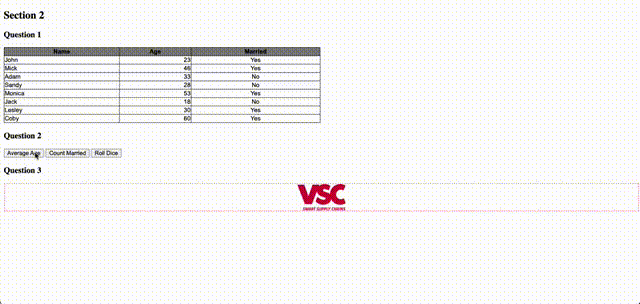

# symmetrical-octo-doodle

###Simple vanilla JavaScript assessment application. 

Some very basic css, javascript and html. This repo is probably a good example of wrong programming can go if not done 
well. 

The details of the assigment can be found in [Assessment Questions.pdf](Assessment Questions.pdf).

The [Vsc Solution.pdf](Vsc Solution.pdf) file is for the "theory" section of this assessment.

Finally, below is a demo of the app requirements in action to save everyones time from cloning etc:

##Demo
